## Getting Started

To successfully deploy this project for your own benefit please follow the provided steps. 

1. Create a github account
    - **💡 Advice:** When setting your github username you will want to pick something professional
2. Create a repo named `blog` 
    - leave it empty nothing else
3. Create another repo named `<username>.github.io`
    - Create a file named `index.html`
    - 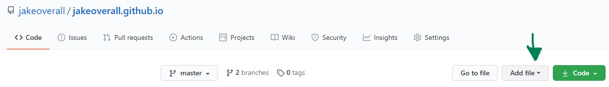
    - For now simply copy and paste this [dummy example code](https://gist.github.com/jakeoverall/a0dc5ee71c31a9129574f110ee6edc9a#file-index-html)
    - 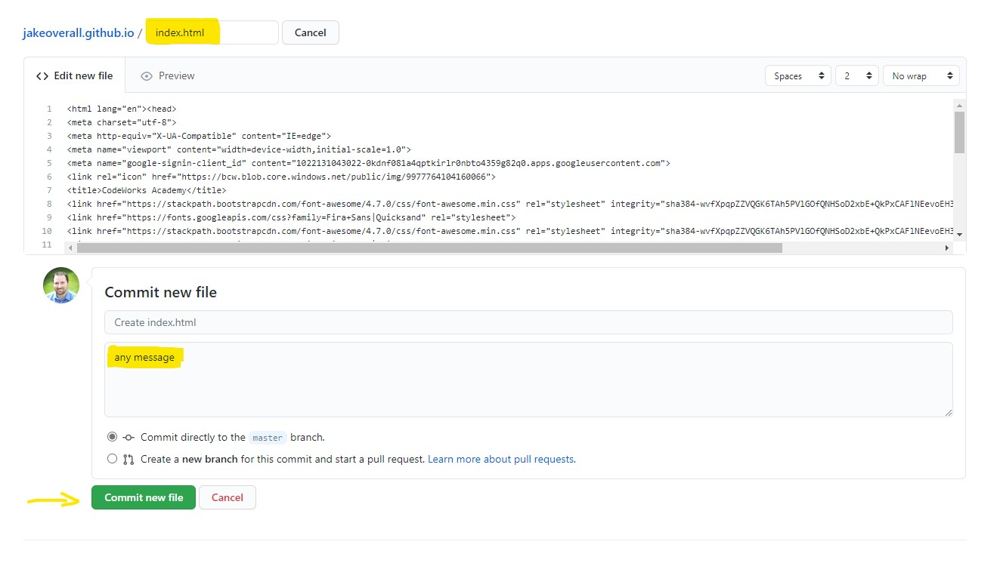
    - Commit your changes
4. Publish your site
    - Go to your repository settings
    - Scroll down to **GH Pages**
    - Enable serving the `Main` branch
    - 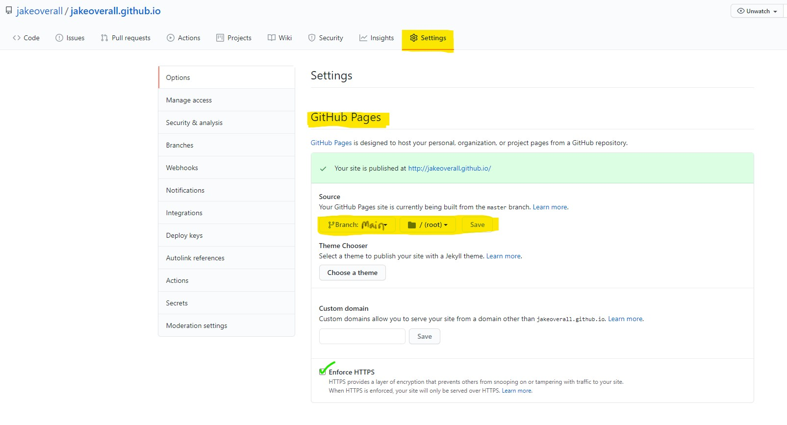
    - Your site may take a few minutes to deploy you can test your deployment by going to `https://<username>.github.io`
5. Adding the Workbook as a blog `https://<username>.github.io/blog`
    - Please follow these next steps carefully
    - Star and Fork this Project
    - 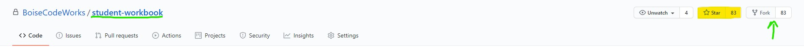
6. Create a Personal Access Token
    - Go to your `settings -> developer settings -> Personal Access Token` 
    - then create a new Personal Access Token called `DEPLOY_KEY`
    - 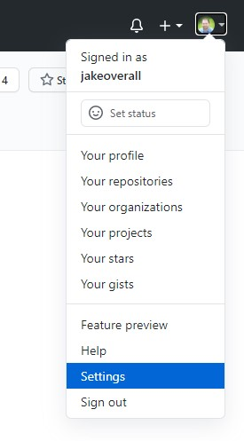
    - 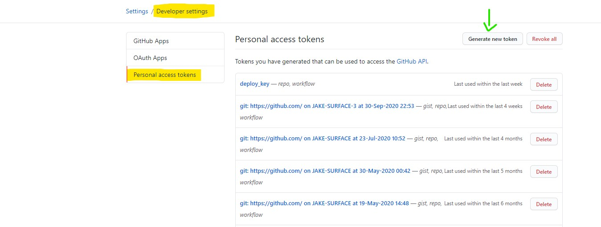
    - 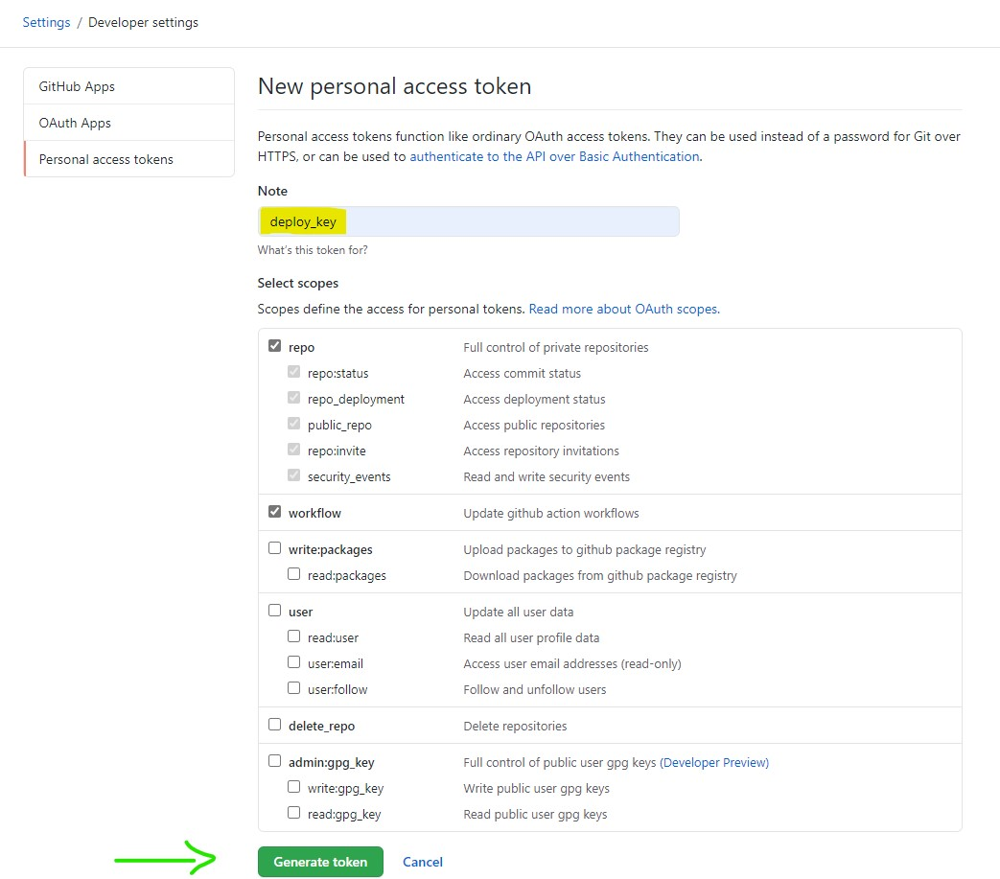
    - ⚠ **Do Not Share this token with anyone**
    - 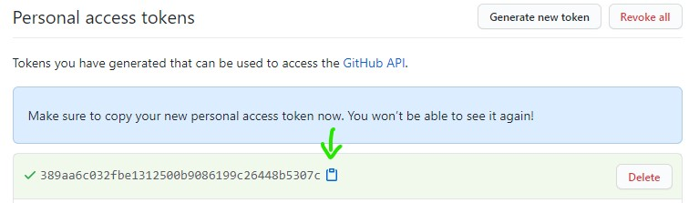
    - Copy the token you'll need it in the next step, once you navigate away from this page the token will be permanently hidden
7. Add your `DEPLOY_KEY` Secret
    - With your Personal Access Token copied return to your forked version of this repository and go to the `settings -> secrets` tab
    - Add a new **secret** named `DEPLOY_KEY` 
    - 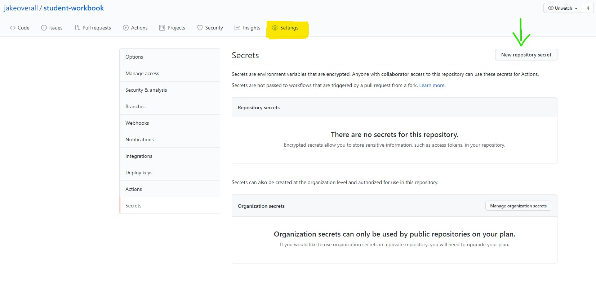
    - 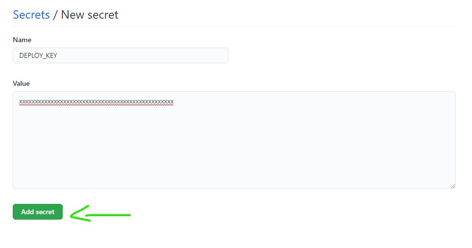
8. Update 📁 `.github\workflow\main.yml`
    - update the line with the `# todo` to your github username
    - 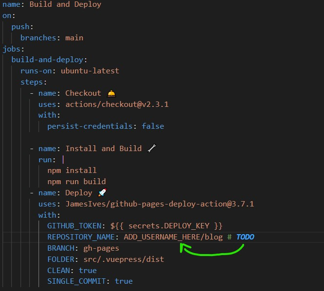
9. Update 📁 `src\.vuepress\config.js`
    - update the line with the `# todo` to your github username
    - 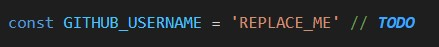
10. Test it
    - Add a blog post
    - Commit and push then new post
    - test your live site by going to `https://<username>.github.io/blog`
 > This deploy goes through a build process so it may take a few minutes for the changes to be reflected on the live page
